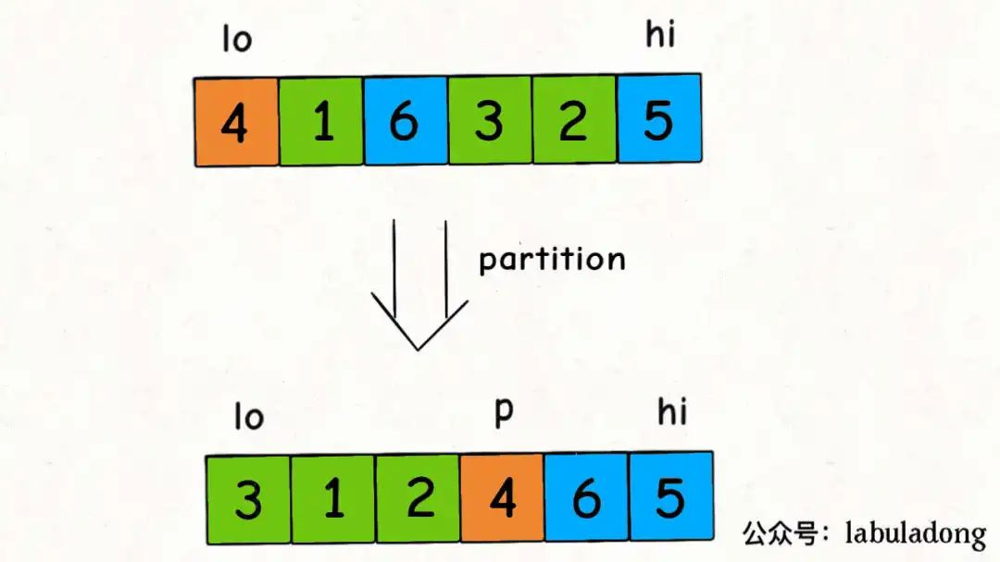

# 一、排序的基本概念

1. 定义：排序就是重新排列列表中的元素，使表中的元素满足按关键字递增或递减的过程
2. 算法的稳定性：如果某个数排序前在一个数的前面，经过排序后（两个相同的数）仍在前面，则说明这个排序算法是稳定的。
3. 内部排序：在排序期间元素全部存放在内存中的排序
4. 外部排序：在排序期间元素无法全部同时存放在内存中，必须在排序的过程中根据要求不断地在内，外存之间移动的排序
5. 排序的时间复杂度由比较和移动的次数决定

# 二、排序算法

## 1.快速排序

参考链接：[快排](https://mp.weixin.qq.com/s?__biz=MzAxODQxMDM0Mw==&mid=2247496139&idx=1&sn=b0aca0f2b98e23495c9bd13bb4d90e40&chksm=9bd40fc3aca386d5687dc10ddb1034b71df7584add74c4eb5ab95bbcc2da58cf8402507fad24&mpshare=1&scene=23&srcid=03286EQIeZNhidXsIfQdXz66&sharer_sharetime=1648477550095&sharer_shareid=423c0785a9678b96a44bba6bc588c98e%23rd)

快速排序是**一次**先将**一个**元素排好序，然后再将剩下的元素排好序。

```java
void sort(int[] nums, int lo, int hi) {
    if (lo >= hi) {
        return;
    }
    // 对 nums[lo..hi] 进行切分
    // 使得 nums[lo..p-1] <= nums[p] < nums[p+1..hi]
    int p = partition(nums, lo, hi);
    // 去左右子数组进行切分
    sort(nums, lo, p - 1);
    sort(nums, p + 1, hi);
}
```

从代码框架来看，快排很似于二叉树的前序遍历

快速排序的核心无疑是 `partition` 函数， `partition` 函数的作用是在 `nums[lo..hi]` 中寻找一个分界点 `p`，通过交换元素使得 `nums[lo..p-1]` 都小于等于 `nums[p]`，且 `nums[p+1..hi]` 都大于 `nums[p]`：



如果在极端情况下，快排的时间复杂度会接近O(N*N)，因此引入随机性来避免这种极端情况