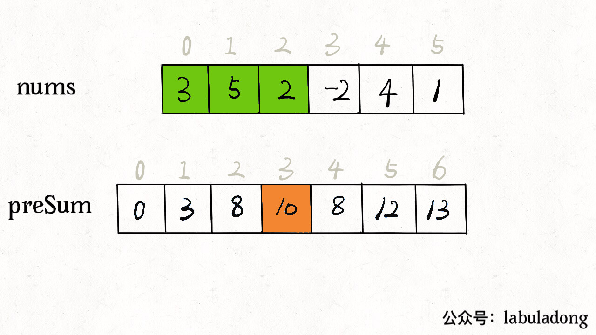
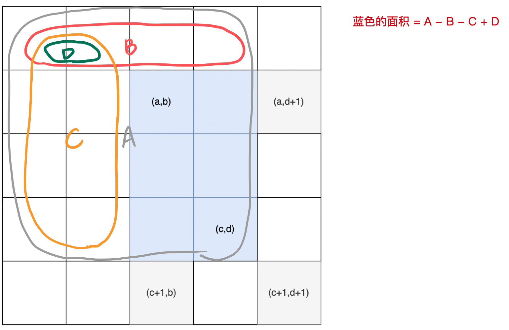

# 参考链接

[小而美的算法技巧：前缀和数组](https://labuladong.gitee.io/algo/2/19/22/)

## 整体理解

## 一、应用场景

需要频繁的对同一个数组求一个区间的和，利用前缀和数组，不需要对每个区间的元素便利累加。将时间复杂度将为O(1)

## 二、操作步骤

### 1.构造前缀和数组

前缀和数组，故名事宜，前缀和数组的元素preSUm[i]记录的是原数组nums[0...i-1]的累加和  

公式: $preSum[i] = preSum[i-1] + nuts[i]$



因此想要求某个区间[i,j]的和，就可以通过preSum[j+1]-preSum[i]获得，避免便利整个区间的元素

### 2.原理分析

可以理解为一个大的区间减去左边的区间，得到右边区间的和。

preSum[i]存的是从nums[i]从nuts[0]到nums[i]的和，preSum[j]也是同理。

举例：`nums[] = {1,2,3,4,5,6,7}` 要求nums[2]到nums[6]的和，区间和为`preSum[j+1]-preSum[i]`preSum[2]=1+2，preSum[7] = 1+2+3+4+5+6+7。因此和为 3+4+5+6+7。

### 3.代码实现

```c++
vector<int> preSum(nums.size()+1);
// 方便求和统一操作
preSum[0] = 0;
// preSum的长度比nums大1，因此加的是nums[i-1]而不是nums[i]
for(int i=1;i<=nums.size();i++){
  preSum[i] = preSum[i-1] + nums[i-1];
}
```

## 三、特殊优化

如果是顺序访问前缀和数组，可以简化掉数组，仅使用一个变量维护当前的前缀和即可，例如下面的leetcode.560

## 四、相关例题

### [303. 区域和检索 - 数组不可变](https://leetcode-cn.com/problems/range-sum-query-immutable/)

给定返回区间的区间和，设计封装成一个类，直接构造返回就行


### [304. 二维区域和检索 - 矩阵不可变](https://leetcode-cn.com/problems/range-sum-query-2d-immutable/)

从一维上升到二维码空间，去区间上升到了区域面积，计算方法稍微复杂一点，整体思路还是一样。

如何求子区域的区域和，需要将整个区域划分成4个部分



图中貌似(x,y)反了

需要将第一行和第一列均设置为0，因此左右偏移一个单位

`preSum[x][y]`就代表从(0,0)到(x-1,y-1)的面积

c区域的面积是preSum[a,d+1]。why？因为c的右下角坐标是[a-1,d]整体+1.

- 如何求`preSum[x][y]`

`preSum[x][y] = preSum[x-1][y]+preSum[x][y-1]+nums[x][y]-preSum[x-1][y-1]`

简单描述就是`preSum[x][y]`是原点到左边区域+原点到上边的区域+x,y的值-重复计算的区域原点到左上角到区域

- 如何求蓝色部分的面积

给定左上角坐标(a,b),右下角(c,d),因此蓝色部分的面积就可以表示为`preSum[c+1,d+1]-preSum[a,d+1]-preSum[c+1,b]+preSum[a+1,b+1]`

#### [560. 和为 K 的子数组](https://leetcode-cn.com/problems/subarray-sum-equals-k/)

这里的子数组也就是一个区间，换言之，就是满足`preSum[j]-preSum[i]=k`的个数是多少。

开始想到的是使用双指针来遍历前缀和数组，but，双指针只能在有序的数组中才能使用，前缀和数组不是有序的！！！

**解法**：前缀和+哈希表。依次遍历前缀和数组，并且查找哈希表中k-preSum[i] 的个数，然后将preSum[j]存入哈希表

