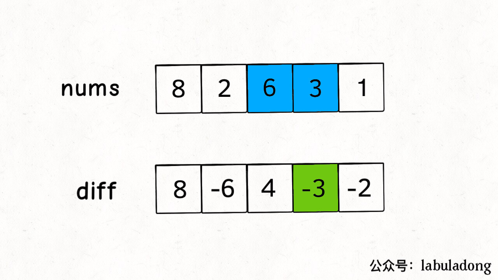
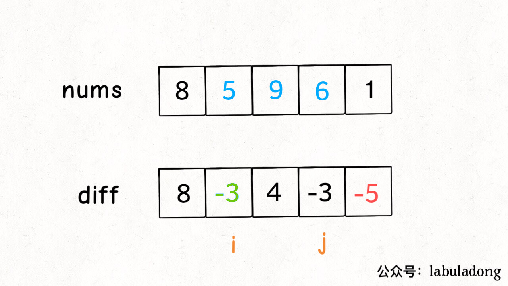

# 相关参考

[小而美的算法技巧](https://labuladong.gitee.io/algo/2/19/23/)

# 整体理解

## 一、应用场景

**差分数组的主要适用场景是频繁对原始数组的某个区间的元素进行增减**，利用差分数组可以将运算的时间复杂度从**O(n)**下降到**O(1)**。

## 二、操作步骤

### 1.构造差分数组

类似前缀和技巧构造的 `prefix` 数组，我们先对 `nums` 数组构造一个 `diff` 差分数组，**`diff[i]` 就是 `nums[i]` 和 `nums[i-1]` 之差**



```c++
// 构造差分数组
vector<int> diff(nums.size());
diff[0] = nums[0];
for(int i=1;i<nums.size();i++){
  diff[i] = nums[i] - nums[i-1];
}
```

### 2.复原差分数组

利用前缀和来恢复差分数组  

比如原nums = [1，2，3，4，5]  

差分数组 diff = [1, 1, 1 , 1 ,1]

前缀和公式为presum[i] = presume[i-1] + nuts[i]，presum = [1, 2, 3, 4, 5]

### 3.相关操作

**这样构造差分数组 `diff`，就可以快速进行区间增减的操作**，如果你想对区间 `nums[i..j]` 的元素全部加 3，那么只需要让 `diff[i] += 3`，然后再让 `diff[j+1] -= 3` 即可：



### 4.原理分析

**原理很简单，回想 `diff` 数组反推 `nums` 数组的过程，`diff[i] += 3` 意味着给 `nums[i..]` 所有的元素都加了 3，然后 `diff[j+1] -= 3` 又意味着对于 `nums[j+1..]` 所有元素再减 3，那综合起来，是不是就是对 `nums[i..j]` 中的所有元素都加 3 了**？

只要花费 O(1) 的时间修改 `diff` 数组，就相当于给 `nums` 的整个区间做了修改。多次修改 `diff`，然后通过 `diff` 数组反推，即可得到 `nums` 修改后的结果。

### 5.设计封装

```c++
class Difference {
    // 设计一个差分数组的class
    // 差分数组
private:
    vector<int> diff;
public:
    /* 输入一个初始数组，区间操作将在这个数组上进行 */
    Difference(vector<int>& nums){
        diff.resize(nums.size());
        // 根据初始数组构造差分数组
        diff[0] = nums[0];
        for(int i=1;i<nums.size();i++){
            diff[i] = nums[i] - nums[i-1];
        }
    }
    /* 给闭区间 [i,j] 增加 val（可以是负数）*/
    void increment(int i, int j, int val){
        diff[i]+=val;
        if(j+1<diff.size()){
            // 防止数组越界
            diff[j+1]-=val;
        }
    }

    vector<int> result(){
        // 返回结果数组, 还原diff数组
        vector<int> res(diff.size());
        res[0] = diff[0];
        for(int i=1;i<diff.size();i++){
            res[i] = res[i-1] + diff[i];
        } 
        return res;
    }
};
```


## 三、相关例题

### 1.leetcode370.区间加法

### 2.leetcode1109.航班预定统计

```
输入：bookings = [[1,2,10],[2,3,20],[2,5,25]], n = 5
输出：[10,55,45,25,25]
```

输入是很明确的三元组，只需要注意这里的起始是**1**而不是**0**，所以对于输入的三元组 `(i,j,k)`，数组区间应该对应 `[i-1,j-1]`。

```c++
class Solution {
public:
    vector<int> corpFlightBookings(vector<vector<int>>& bookings, int n) {
        vector<int> ret(n,0);
        Difference Diff(ret);
        for(vector<int> booking:bookings){
            Diff.increment(booking[0]-1,booking[1]-1,booking[2]);
        }
        return Diff.result();
    }
};
```

### 3.leetcode1094.拼车

Notes：

- 不能直接获得差分数组的区间长度，只能根据题目的范围给1001
- 注意区间要求，比如输入[[2,1,5],[3,5,7]] 3 代表的意思是最大容量为3，1-5段时车上有2人，5-7段时车上有3人，注意在**5**这个时刻是会有上下车的情况发生,人数要以后面的记录为准，所以区间是[1,5)和[5,7)。

```c++
class Solution {
public:
    bool carPooling(vector<vector<int>>& trips, int capacity) {
        // 注意初始化区间
        vector<int> ret(1001,0);
        Difference Diff(ret);
        for(vector<int> onetrip:trips){
            // 注意区间范围 
            Diff.increment(onetrip[1],onetrip[2]-1,onetrip[0]);
        }
        vector<int> ans = Diff.result();
        for(int x:ans){
            if(x>capacity){
                return false;
            }
        }
        return true;
    }
};
```


